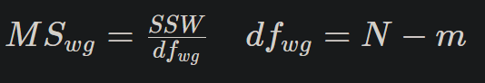

# Генеральная совокупность и выборка.

**генеральная совокпность** это множесто объектов 
на основе которых хотелось бы делать выводы в рамках исследований

**выборка** - это подмножество генеральной совокупности, над которым проводятся
исследования, и полученные результаты в дальнейшем проецируются на генеральную совокупность 

**репрезентативность выборки** - выборка является моделью, отражающей свойства генеральной совокупности

1. Простая случайная выборка (simple random sample)
2. Стратифицированная выборка (stratified sample) выборка из каждой обособленной группы с различными свойствами
3. Групповая выборка (claster sample) выборка из нескольких подобных групп с подобными свойствами

# Типы переменных. 

1. Количественные
   1) Непрерывые [1, 1.5, 1.59, 2]
   2) Дискретные [1,2,3]
2. номинативные (качественные)

# Меры центральной тенденции

Мода распределения - наиболее встречаемое значение признака

Медиана - значение признака которое делит упорядоченное множество данных пополам
для четного медиана будет составляють среднее значение из наиболее встречаемых (a+b)/2

Среднее значение(мат ожидание) - сумма значений деленное на их кол-во (выборочное среднее x&#773;)

Свойства среднего значения:
1. Если к каждому значению выборки прибавить число, то среднее значение так же увеличится на это число M x+c = M x + c 
2. Умножение каждого значения на число, так же увеличит среднее значение в это число раз  M x*c = M x * c
3. Сумма отклонений от среднего арифметического, для каждого значения выборки, равно нулю  Σ (x i - M x) = 0

# Меры изменчивости

Размах(range) - разность максимального и минимального значений

Дисперсия - средний квадрат отклонение индивидуальных значений признака от их средней величины D

D =  (Σ (xi - x&#773;)2) / n  - для генеральной совокупноси

D =  (Σ (xi - x&#773;)2) / (n - 1) - для выборки

Средне квадратичное отклонение генерально совокупности - сигма σ = sqrt(D)

Стандартное отклонение выборки sd2 = D

Свойства дисперсии:
1. Dx + c = Dx
2. sdx + c = sdx
3. sdx * c = sdx * c
4. Dx * c = Dx * c2

# Квартили распределения и график box-plot

Квартили - три точки(значения признака) которые делят упорядоченное множество данных на четыре равные части

меж квантильный размах - разница между третьим и первым квантилями

# Нормальное распределение
Нормальное распределение:
1. Унимодальное 
2. Симметричное 
3. Отклонения наблюдений от среднего подчиняются определенному вероятностному закону

Стандартизация (z-преобразование) - преобразование полученных данных в стандартную Z-шкалу(Z-score) со средним x&#773;z = 0 и sdz = 1
z-score = (xi - x&#773;) / sd

Правило трех σ

1. Mx ​ ± σ ≈ 68%
2. Mx ​ ± 2σ ≈ 95%
3. Mx ​ ± 3σ ≈ 100%

# Центральная предельная теорема

ЦПТ - Пусть есть признак, распределенный КАК  УГОДНО* с некоторым средним и некоторым стандартным отклонением. Тогда, если мы будем выбирать из этой совокупности выборки объема n, то их средние тоже будут распределены нормально со средним равным среднему признака в ГС и отклонением стандартным отклонением, se

* *определенные ограничения на распределение все-таки накладываются, например, распределение должно обладать конечной дисперсией, да и так бывает, бывают распределения, у которых дисперсия и вовсе не определена!

стандартная ошибка среднего - Чем больше выборка, тем точнее оценка среднего и тем меньше его стандартная ошибка. Стандартная ошибка среднего возрастает с увеличением стандартного отклонения совокупности. se = σ/sqrt(m) m - кол-во выборок

стандартная ошибка среднего - это среднеквадратическое отклонение распределения выборочных средних

se = sd/sqrt(n) n-кол-во наблюдений в выборке при n > 30 (t - распределение)

https://gallery.shinyapps.io/CLT_mean/

# Доверительный интервал

интервал на котором мы можем утверждать с определенной веротностью что на нем находится среднее ГС полученное на основе данных выборки

используется для оценки параметров ГС основываясь на выборочных данных

99% доверительный интервал для x&#773;=10 sd = 5 n = 100

se = 5 / sqrt(100) = 0.5

99% => 2.575829σ 

M = x&#773; ± 99% * se  = 10 ± 2.575829 * 0.5

M = [8,71 ; 11,29]

95% => 1.959964
n = 64,  sd = 4,   M = 18.5

se = 4 / sqrt(64) = 4/8 = 0.5

M = 18.5 ± 1.959964 * 0.5 => [17.52, 19.48]
# Идея статистического вывода, p-уровень значимости

p-уровень значимости - вероятность получить различия обсолютно случайно

z = (x&#773; - M) / se

p < 0.05 не достаточно доставерно

ститистическая ошибка:
1. первого рода - отклонили нулевую гепотизу, хотя она была верна
2. второго рода - не отклонили нулевую гепотизу, хотя была верна альтернативная

Значение p-уровня значимости, которое выбирается, в качестве порога обозначается буквой 
α

n = 144 x&#773; = 118 sd = 9

se = 9 / sqrt(144) = 0.75

z = (115 - 118) / 0.75 = 4 (https://en.wikipedia.org/wiki/Standard_deviation#Rules_for_normally_distributed_data)

H0 => 115

https://gallery.shinyapps.io/dist_calc/

P(X < -4 or X > 4) = 6.33e-05

# T-распределение

Распределение Стьюдента используется в том случае если неизвесто стандартное отклонение ГС

число степеней свободы (df = n - 1) зависит от кол-ва наблюдений в выборке 

при 30 степенях свободы t распределение приближается к нормальному

t = (x&#773;-μ) / sd / sqrt(n)

# Сравнение двух средних; t-критерий Стьюдента

se = sqrt( (sd12 / n1) + (sd22 / n2) )

df = n1 + n2 - 2

t = (x&#773;1 - x&#773;2) / se

1. требование гомогенности дисперсий - они должны быть приблезительно одинаковыми (проверяется критерями Левена и Фишера(F-тест))

2. если объем выборки < 30, то очень важно нормальность распределения обеих выборок
   1. при выборки > 30 t-распределение справляется с задачей даже если распределение внутри выборок отлично от нормального

> Знание t-распределения поможет нам корректно рассчитать границы доверительного интервала, особенно в тех случаях, если число наблюдений меньше 30. Ранее при расчете 95% доверительного интервала мы использовали формулу 

> x&#773; ± 1,96 * sd/sqrt(n)

> Однако 95% всех наблюдений в случае t-распределения могут лежать в более широком диапазоне. 

> Рассчитайте доверительный интервал основываясь на знании t - распределения для среднего значения температуры плавления ДНК у первого вида:

> x&#773;=89,9 sd=11,3 n=20

> Для этого определите, в каком диапазоне находится 95 % наблюдений у соответствующего t - распределения (df = n -1) и используйте это значение вместо коэффициента 1,96. 

> Давайте воспользуемся таблицей критических значений для t - распределения для нахождения нужного t - значения :

http://www.medcalc.org/manual/t-distribution.php

> В этой таблице нас интересует столбец, где A=0,95 (область под кривой). На пересечении этого столбца и строки с нужным числом степеней свободы и находится интересующее нас значение.]

89.9 ± 2.093 * 11.3/sqrt(20)

89.9 ± 5.1480993046 = [84.61 ; 95.x`19]

> Первые премии Оскар за лучшую мужскую и женскую роль были вручены в 1929. Данные гистограммы демонстрируют распределение возраста победителей с 1929 по 2014 год (100 мужчин, 100 женщин). Используя t - критерий проверьте, можно ли считать наблюдаемые различия в возрасте между лучшими актрисами и актерами  статистически достоверными.

>Средний возраст мужчин равен 45, sd = 9.

>Средний возраст женщин равен 34, sd = 10.

t = (45 - 34) / sqrt(9*9 / 100 + 10*10 / 100) = 8,176

df = 198

P(X < -8.176 or X > 8.176) = 3.46e-14

Отклоняем нулевую гипотезу о равенстве средних (p<0,05)

# Проверка распределения на нормальность, QQ-Plot

QQ Plot - показывает на сколько наши выборочные значения соответствуют предсказанным значениям, если бы наше распределение было бы идеально нормальным 

тесты Шапиро-Уилка и Колмогорова-Смирнова позволяют проверить гепотизу о том что выборка изъята из ГС где распределение признака соответствует нормальному

в случае отличия распределения признака от нормального применяется не параметрический аналог  - U критерий Манна — Уитни

# Однофакторный дисперсионный анализ

Очень часто в экспериментах и исследованиях возникает необходимость сравнить несколько групп между собой. В таком случае мы можем применять однофакторный дисперсионный анализ.  

Та переменная, которая будет разделять наших испытуемых или наблюдения на группы (номинативная переменная с нескольким градациями) называется независимой переменной. 

А та количественная переменная, по степени выраженности которой мы сравниваем группы, называется зависимая переменная. 

Общая сумма квадратов (SST) - показатель который характеризует на сколько высока изменчивость наших данных без учета разделения их на группы

Межгрупповая сумма квадратов SSB dfssb = число групп - 1

Внутри групповая сумма квадратов SSW dfssw = число элементов всех групп - кол-во групп

F-значение(Распределение Фишера)  = SSB / dfssb / SSW / dfssw

Когда мы делим значение межгрупповой суммы квадратов на соответствующее число степеней свободы (число групп минус один), мы тем самым усредняем полученный показатель. 

Усредненное значение межгрупповой суммы квадратов называется межгрупповым средним квадратом 

Отношение внутригрупповой суммы квадратов к соответствующему числу степеней свободы (число всех наблюдений минус число групп) — это внутригрупповой средний квадрат 

# Множественные сравнения в ANOVA

Поправка Бонферрони - компенсация параметра альфа, n * (n-1) / 2

Критерий Тьюки

